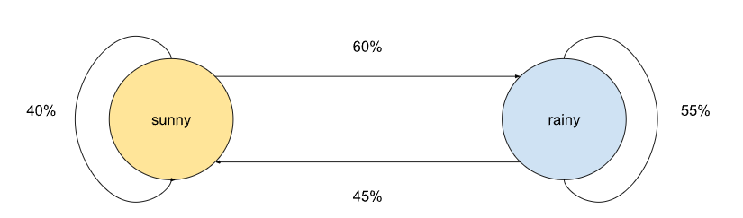
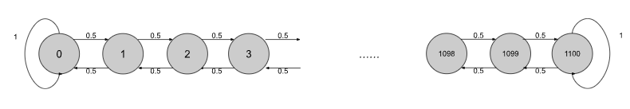
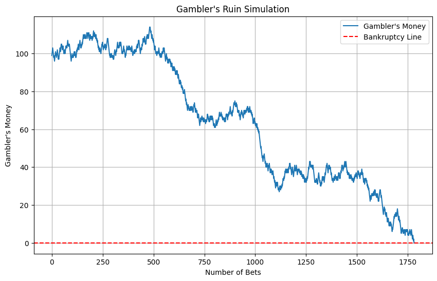

# The Gamblers Ruin
Simple demonstration to show why gambling is BAD

## Background: Markov Chain (Markov Process)
What is Markov Chain?

The ["Oxford Languages"](https://languages.oup.com/google-dictionary-en/) defines the term as "a stochastic model describing a sequence of possible events in which the probability of each event depends only on the state attained in the previous event."

The concept can be easily understood with a simple example.

### Example

Suppose there are only two states in our weather system: sunny days and rainy days. And also assume that the prospect of tomorrow's weather soley depends on today's weather. So the weather two days ago nor yesterday have no say in predicting tomorrow's weather. Only today's weather is what matters. Also, let's assume the probability does not change. For example, if sunny weather today leads to a rainy day tommorrow for 60% of chance, this probability holds in predicting weathers in other days. Then we can say the weather system follows Markov Chain or Markov Process. (Of course in reality this is not the case).


Let's say, sunny day is followed by sunny day tommorrow with 40% of probability and rainy day is followed by rainy day tommorrow with 55% of probability.


The above can be then easily represented with what are called, "transition diagram" and "transition matrix".

#### Transition Diagram




#### Transition Matrix

$$
P = \begin{array}{c|ccc}
 & \text{sunny} & \text{rainy} \\
\hline
\text{sunny} & .4 & .6 \\
\text{rainy} & .45 & .55  \\
\end{array}
$$

Note that the sum of elements in each row is 1. 

#### Calculation

The beauty of transition matrix is it gives you tool to calculate the probability of further states. In our example, it can be predicting weathers in three days, four days and even n days. This would be simply the elements of the $P^n$.

What would be the probability of having rainy day after 3 days given that today is sunny?

We are adding up probabilitys of below events:
1. sunny -> sunny -> sunny
2. sunny -> rainy -> sunny
3. rainy -> sunny -> sunny
4. rainy -> rainy -> sunny

It would be very cumbersum to calculate one by one. However, this can be obtained quite simply using transition matrix.

$$
P^3 = \begin{array}{c|ccc}
 & \text{sunny} & \text{rainy} \\
\hline
\text{sunny} & .4285  & .5715 \\
\text{rainy} & .428625 & .571375  \\
\end{array}
$$

The probability of having sunny day after three days when today is sunny is about 42.85%.

*One takeaway here is that Markov Process is "memoryless": This means previous states does not affect subsequent states. What only matters in predicting the next state is the current state. This property is represented in assuming that the proabilities are constant throughout the process.*

## Ok. Then What is "The Gambler's Ruin"?

The Gambler's Ruin problem is a simple thought experiment showing how difficult for gamblers to win a game in even a very favorable scenario given significant size difference in capital between a gambler and the casino, which is often true. This is illustrated with the concept of Markov Chain.

#### Rules

1. The probability of winning each bet is constant -> hence, "Markov Process" and memoryless property.
2. Each bet either addes one dollar or subtract one dollar only.
3. When either one's money becomes zero (banktrupt), the game ends.
4. The game goes on until one goes bankrupt.

#### Example Scenario

To illustrate this, let's say the gambler starts with 100 dollars and the casino holds 1,000 dollars. And the winning probability for each bet is 50%, which is quite a generous assumption for the gambler.

From the gamblers perspective, if he wins 1,000 bets straight and eventually holds 1,100 dollars, the game ends and the gambler wins.

The transition diagram and the transition matrix are then expressed as below:



If the gambler loses all money then the game stops. So at 0 there is no more transition. It stays zero. The same goes for 1,100.

The above can be expressed in matrix as well. Rows are the current state and columns are the next state.

$$
P = \begin{array}{c|ccccc}
   & \text{0} & \text{1} & \text{2} & \cdots & \text{1099} & \text{1100} \\
\hline
\text{0} & 1 & .5 & \cdots & 0 & 0 \\
\text{1} & .5 & 0 & 0.5 &\cdots & 0 & 0 \\
\text{2} & 0 & 0.5 & 0  & \cdots & 0 & 0 \\
\vdots & \vdots & \vdots & \vdots & \ddots & \vdots & \vdots \\
\text{1099} & 0 & 0 & 0 & \cdots & 0 & 0.5 \\
\text{1100} & 0 & 0 & 0 & \cdots & 0 & 1
\end{array}
$$

For example, when the gambler holds 1 dollar, he holds either 0 or 2 dollars after the bet with 50% of probability each.\
When he goes bankrupt or end up holding the whole money there is, that is the casino loses 1,000 dollars and goes bankrupt, the game ends. 

#### How it will end?: Theoratical Explanation.

As can be also seen in the simple simulation I presented in the python file, given large differences in initial capitals held by the gambler and casino, the gambler is almost always destined to lose.

Let's define P_i as the probability of winning the game (not each bet) when the gambler currently holds *i* dollars.\
Then the recursive relation can be written as below:

$$
P_i = 0.5 P_{i+1} + 0.5 P_{i-1} \\ s.t. \ P_0 = 0,\ P_{1100} = 1
$$

$P_0$ and $P_{1100}$ is 1, because when either one of them is bankrupt no further bet is made. In other cases, $P_i$ = (probability of losing a bet) * $P_{i+1}$ + (probability of winning a bet) * $P_{i-1}$.

We can solve this and obtain $P_k$ where k is 0, 1, ... , 1100.

$$
\begin{align}
    &P_i = 0.5 P_{i+1} + 0.5 P_{i-1}\\
    &2P_i = P_{i+1} + P_{i-1}\\
    &P_{i+1} - P_i = P_i - P_{i-1}
\end{align}
$$

When i = 1:

$$
\begin{align}
    (i = 1)\\
    &P_{2} - P_1 = P_1 - P_{0}\\
    &P_{2} = 2P_1 \ (\because P_0 = 0)
\end{align}
$$

When i = 2:

$$
\begin{align}
    (i = 2)\\
    &P_{3} - P_2 = P_2 - P_{1}\\
    &P_{3} = 3P_1 \ (\because P_2 = 2P_1)
\end{align}
$$

If we generalize the above, when k:

$$
\begin{align}
    (general\ case)\\
    &P_{k} = kP_1 \\
\end{align}
$$

Solving $P_k$ we get:

$$
\begin{align}
    &P_{1100} = 1100P_1 \\
    since\\ 
    &P_{1100} = 1\\
    &P_{1} = \frac{1}{1100}\\
    \therefore &P_{k} = \frac{k}{1100}
\end{align}
$$

#### Conclusion

So the probability that a gambler beats the casino holding 1,000 dollars with 100 dollars is $\frac{100}{1,100}$ even with very favorable assumption that he wins each bet with 50% probability.

What usually happens in real life is the gap in resources is a lot more huge and the probability is a lot less favorable.

Suppose the gambler holds M dollars and the casino holds N dollars. Then the probability is $\frac{M}{M + N}$. When N is sufficiantly large, this becomes near zero.

## Simulation

I made a simple python code to demonstrate this. I uploaded this in the same repository. 

If we apply the above example, type like this:

```python
# Example usage
gambler_money = 100          #usually small
casino_money = 1000          #usually large
win_probability = 0.5       

plot_gambler_ruin(gambler_money, casino_money, win_probability)
```

The result, which differs everytime you run the function, will look like this:



In this simulation, the gambler lost all the money after 1750+ bets.
